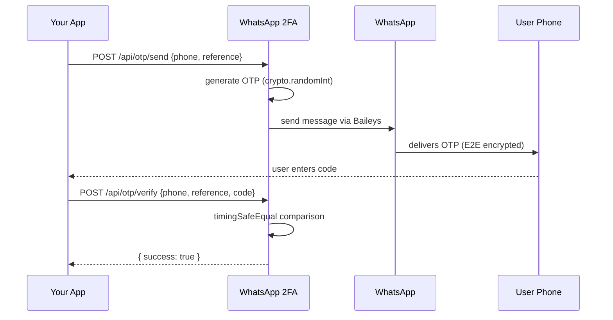

<p align="center">
  
</p>

<p align="center">
  <a href="https://nodejs.org/"></a>
  <a href="#"></a>
  <a href="#api-reference"></a>
  <a href="LICENSE"></a>
</p>

---

## What it is

Send OTPs over WhatsApp. Self-hosted. No Twilio. Connects directly to WhatsApp via [Baileys](https://github.com/WhiskeySockets/Baileys) -- no Business API, no SMS gateway fees. Pair a sender number once via QR, then hit two endpoints to send and verify codes.

---

## Auth Flow



The OTP is never returned in any API response. It exists only in server memory and the WhatsApp message.

---

## Quick Start

```bash
git clone https://github.com/darshjme/whatsapp-2fa.git && cd whatsapp-2fa
npm install
cp .env.example .env   # set API_KEY and APP_NAME
npm start              # scan QR on first run
```

On first launch a QR code prints to terminal. Scan it with the WhatsApp account that will send OTPs. Auth persists in `auth_store/` -- subsequent starts reconnect automatically.

Dev mode with auto-reload: `npm run dev`

---

## API Reference

All `/api` endpoints require `X-API-Key` header when `API_KEY` is set. `/health` is always open.

### Send OTP

```bash
curl -X POST http://localhost:3000/api/otp/send \
  -H "Content-Type: application/json" \
  -H "X-API-Key: your-secret-key" \
  -d '{"phone": "919876543210", "reference": "login-session-abc"}'
```

| Field | Type | Rules |
|-------|------|-------|
| `phone` | string | Country code + number, digits only, 7-15 chars |
| `reference` | string | Session/transaction ID. Alphanumeric, `-_.` allowed. Max 128 |

**200 OK:**
```json
{
  "success": true,
  "phone": "919876543210",
  "reference": "login-session-abc",
  "expiresAt": "2025-01-15T10:10:00.000Z"
}
```

**429 Rate Limited:**
```json
{
  "error": "Too many OTP requests. Try again later.",
  "retryAfterSeconds": 1823
}
```

### Verify OTP

```bash
curl -X POST http://localhost:3000/api/otp/verify \
  -H "Content-Type: application/json" \
  -H "X-API-Key: your-secret-key" \
  -d '{"phone": "919876543210", "reference": "login-session-abc", "code": "482910"}'
```

**200 OK:**
```json
{ "success": true }
```

**Failure responses:**

| Reason | Status | Meaning |
|--------|--------|---------|
| `not_found` | 404 | No OTP for this phone/reference |
| `expired` | 410 | Past validity window |
| `max_attempts` | 429 | Too many wrong guesses, OTP invalidated |
| `invalid` | 401 | Wrong code |
| `already_verified` | 409 | Already used |

---

## Rate Limiting

<p align="center">
  
</p>

Per-phone progressive backoff. Each OTP request requires waiting the specified interval after the previous one.

| Request | Delay | Why |
|---------|-------|-----|
| 1st | None | Immediate for legitimate users |
| 2nd | 2 min | Catches automated retries |
| 3rd | 5 min | Slows enumeration scripts |
| 4th | 10 min | Friction for suspicious patterns |
| 5th | 60 min | Strong deterrent |
| 6th+ | 3,600 min | Effective lockout |

Stale entries are auto-cleaned every 60s.

---

## Configuration

| Variable | Default | Description |
|----------|---------|-------------|
| `PORT` | `3000` | Server port |
| `API_KEY` | _(empty = open)_ | Timing-safe authenticated key |
| `APP_NAME` | `MyApp` | Name in OTP message template |
| `LOG_LEVEL` | `info` | `debug` / `info` / `warn` / `error` / `fatal` |
| `OTP_LENGTH` | `6` | Digit count |
| `OTP_EXPIRY_SECONDS` | `600` | Validity window (10 min default) |
| `OTP_MAX_ATTEMPTS` | `3` | Wrong guesses before invalidation |
| `OTP_MESSAGE_TEMPLATE` | _(see .env.example)_ | Supports `{{otp}}` and `{{app_name}}` |

---

## Security

- OTP generation via `crypto.randomInt` (CSPRNG), not `Math.random`
- Verification uses `crypto.timingSafeEqual` -- immune to timing attacks
- API key compared with constant-time equality
- Six-tier progressive rate limiting per phone number
- Max 3 verification attempts per OTP, then permanent invalidation
- Strict input validation: phone `^\d{7,15}$`, reference `^[\w.\-]{1,128}$`
- Request body capped at 16 KB
- Stack traces never leak to clients
- OTP codes never written to logs or API responses
- Exponential backoff reconnection with 25% jitter
- Graceful shutdown on SIGTERM/SIGINT

---

## Integration Example

```javascript
const API = 'http://localhost:3000/api';
const headers = {
  'Content-Type': 'application/json',
  'X-API-Key': process.env.WHATSAPP_2FA_KEY,
};

async function sendOtp(phone, sessionId) {
  const res = await fetch(`${API}/otp/send`, {
    method: 'POST', headers,
    body: JSON.stringify({ phone, reference: sessionId }),
  });
  if (!res.ok) throw new Error((await res.json()).error);
  return res.json();
}

async function verifyOtp(phone, sessionId, code) {
  const res = await fetch(`${API}/otp/verify`, {
    method: 'POST', headers,
    body: JSON.stringify({ phone, reference: sessionId, code }),
  });
  return res.json();
}

// usage
const sid = `login-${Date.now()}`;
await sendOtp('919876543210', sid);
const result = await verifyOtp('919876543210', sid, '482910');
if (result.success) console.log('authenticated');
```

---

## License

[MIT](LICENSE)

---

<p align="center">
  <a href="https://darshj.me">darshj.me</a>
</p>
